Minería de datos. Métodos no supervisados. Hawks análsis
================
Autor: Oliver Luque Caballero
Marzo 2024

``` r
if (!require('Stat2Data')) install.packages('Stat2Data')
library(Stat2Data)
data("Hawks")
```

``` r
glimpse(Hawks)
```

    ## Rows: 908
    ## Columns: 19
    ## $ Month        <int> 9, 9, 9, 9, 9, 9, 9, 9, 9, 9, 10, 10, 10, 10, 10, 10, 10,…
    ## $ Day          <int> 19, 22, 23, 23, 27, 28, 28, 29, 29, 30, 5, 8, 9, 10, 11, …
    ## $ Year         <int> 1992, 1992, 1992, 1992, 1992, 1992, 1992, 1992, 1992, 199…
    ## $ CaptureTime  <fct> 13:30, 10:30, 12:45, 10:50, 11:15, 11:25, 13:30, 11:45, 1…
    ## $ ReleaseTime  <fct> ,  ,  ,  ,  ,  ,  ,  ,  ,  ,  ,  ,  ,  ,  ,  ,  ,  ,  ,  …
    ## $ BandNumber   <fct> 877-76317, 877-76318, 877-76319, 745-49508, 1253-98801, 1…
    ## $ Species      <fct> RT, RT, RT, CH, SS, RT, RT, RT, RT, RT, RT, RT, RT, RT, R…
    ## $ Age          <fct> I, I, I, I, I, I, I, A, A, I, I, I, A, A, I, A, I, A, I, …
    ## $ Sex          <fct> , , , F, F, , , , , , , , , , , , , , , , , , , , , M
    ## $ Wing         <dbl> 385, 376, 381, 265, 205, 412, 370, 375, 412, 405, 393, 37…
    ## $ Weight       <int> 920, 930, 990, 470, 170, 1090, 960, 855, 1210, 1120, 1010…
    ## $ Culmen       <dbl> 25.7, NA, 26.7, 18.7, 12.5, 28.5, 25.3, 27.2, 29.3, 26.0,…
    ## $ Hallux       <dbl> 30.1, NA, 31.3, 23.5, 14.3, 32.2, 30.1, 30.0, 31.3, 30.2,…
    ## $ Tail         <int> 219, 221, 235, 220, 157, 230, 212, 243, 210, 238, 222, 21…
    ## $ StandardTail <int> NA, NA, NA, NA, NA, NA, NA, NA, NA, NA, NA, NA, NA, NA, N…
    ## $ Tarsus       <dbl> NA, NA, NA, NA, NA, NA, NA, NA, NA, NA, NA, NA, NA, NA, N…
    ## $ WingPitFat   <int> NA, NA, NA, NA, NA, NA, NA, NA, NA, NA, NA, NA, NA, NA, N…
    ## $ KeelFat      <dbl> NA, NA, NA, NA, NA, NA, NA, NA, NA, NA, NA, NA, NA, NA, N…
    ## $ Crop         <dbl> NA, NA, NA, NA, NA, NA, NA, NA, NA, NA, NA, NA, NA, NA, N…

## Análisis preeliminar de los datos

Si observamos la documentación del dataset, podemos ver que estas
columnas representan lo siguiente:

- **Month**: Mes en que se realizó la captura de los datos. Los códigos
  van desde “8” que representa septiembre hasta “11” que representa
  diciembre.
- **Day**: Día realizaron las observaciones.
- **Year**: Año en el que se recopilaron los datos, que va desde 1992
  hasta 2003.
- **CaptureTime**: Hora de la captura en formato HH:MM.
- **ReleaseTime**: Hora de liberación en formato HH:MM.
- **BandNumber**: Código de identificación de la banderola utilizada
  para marcar a las aves.
- **Species**: Especie de la ave observada. Los códigos incluyen “CH”
  para Cooper’s, “RT” para Red-tailed y “SS” para Sharp-Shinned.
- **Age**: Código que indica la edad de la ave. “A” se refiere a un
  adulto y “I” a un inmaduro.
- **Sex**: Código que indica el sexo de la ave. “F” representa a una
  hembra y “M” a un macho.
- **Wing**: Longitud (en mm) de la pluma de ala primaria desde la punta
  hasta donde se une a la muñeca.
- **Weight**: Peso corporal (en gramos) del ave.
- **Culmen**: Longitud (en mm) del pico superior desde la punta hasta
  donde se encuentra con la parte carnosa del ave.
- **Hallux**: Longitud (en mm) de la garra de matar.
- **Tail**: Medición (en mm) relacionada con la longitud de la cola
  (inventada en MacBride Raptor Center).
- **StandardTail**: Medición estándar de la longitud de la cola (en mm).
- **Tarsus**: Longitud del hueso básico del pie (en mm).
- **WingPitFat**: Cantidad de grasa en la axila del ala.
- **KeelFat**: Cantidad de grasa en el esternón (medida por tacto).
- **Crop**: Cantidad de material en el buche codificado de “1” a “0”,
  donde “1” indica que está lleno y “0” indica que está vacío.

Vamos a estudiar las diferntes variables antes de empezar a limpiar los
datos:

#### Variables categóricas:

``` r
var_cat <- c( "Species", "Age", "Sex")

par(mfrow=c(2, 2))  # Mostrar varios gráficos

colores <- c("#5386E4", "#F24236", "#A4036F") 

# Iterar a través de las variables
for (i in 1:length(var_cat)) {
  variable <- var_cat[i]
  barplot(table(Hawks[[variable]]), main = paste("Distribución de la variable", variable), xlab = variable, ylab = "Frecuencia", col = colores[i])
}
```

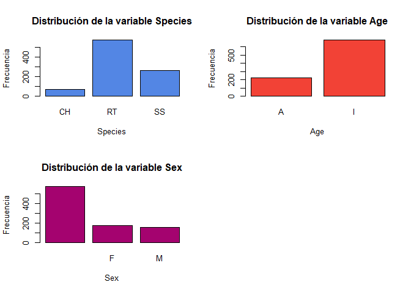<!-- -->

Podemos comentar:

- La especie que aparece con mayor frecuencia es la Red-tailed, seguida
  por la Sharp-Shinned, mientras que Cooper’s presenta el menor número
  de observaciones.

- Hay una mayor cantidad de individuos inmaduros capturados en
  comparación con los adultos.

- Aunque hay numerosos registros sin especificar en la variable de sexo,
  de los que están registrados, la proporción de machos y hembras es
  aproximadamente igual.

``` r
par(mfrow=c(2, 3))  # Mostrar varios gráficos


var_num <- c("Month", "Day", "Year", "Wing", "Weight", "Culmen", "Hallux", "Tail", "StandardTail", "Tarsus", "WingPitFat", "KeelFat", "Crop")

colores <- c("#8D0C59", "#CFF27E",  "#4A7C59","#F24236","#F0C808" ,"#12EAEA","#9000B3",  "#B0DB43", "#550527", "#688E26", "#231651", "#D68910", "#4DCCBD")

# Iterar a través de las variables 
for (i in 1:length(var_num)) {
  variable <- var_num[i]
  hist(Hawks[[variable]], main = paste("Distribución de la variable", variable), xlab = variable, col = colores[i])
}
```

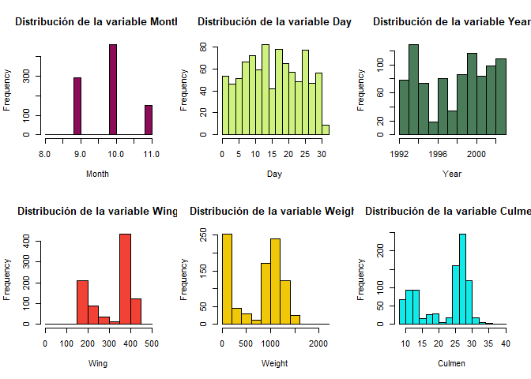<!-- -->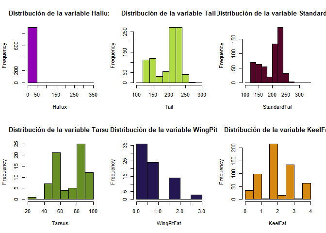<!-- --><!-- -->

Aquí tenemos un análisis detallado de los datos:

- Octubre y noviembre son los meses con mayor número de aves capturadas,
  con diciembre también mostrando cifras altas.

- Los años 1995 y 1997 registraron las menores cifras de capturas de
  ejemplares.

- La medida más frecuente de la pluma de ala primaria es de 400mm,
  seguida por la de 200mm, indicando la existencia de dos grupos
  distintos.

- En cuanto al peso, podemos ver dos grupos ciertamente definidos.

- La medida del culmen muestra también dos grupos claramente
  diferenciados.

- Casi todos los ejemplares presentan una garra de matar con una
  longitud entre 0 y 50mm.

- El MacBride Raptor Center identifica principalmente dos grupos en
  cuanto a la longitud de la cola, uno con medidas generalmente entre
  200mm y 240mm y otro entre 120mm y 160mm.

- La medición estándar de la longitud de la cola es consistente con las
  observaciones del MacBride Raptor Center respecto a la agrupación.

- La longitud más común del hueso básico del pie es de 80mm, con el
  siguiente grupo más común en 50mm, lo que sugiere la presencia de dos
  grupos distintos.

- La grasa en la axila del ala varía de 0.0 a 3.0, siendo los valores
  más frecuentes entre 0.0 y 0.5.

- Los valores más habituales de grasa en el esternón son 2 y 3.

- La mayoría de los buches de los individuos capturados contenían una
  cantidad media o baja de alimento.

## Preparado y tratamiento de los datos

Vamos a centrar este estudio en las variables “Wing”, “Weight”, “Culmen”
y “Hallux” según las diferentes especies. Para ello, es necesario
preparar el dataset adecuadamente, empezando por la limpieza y
preparación de los datos.

### Valores redundantes

Como hemos visto **BandNumber** es el indicador de cada ave, por ello,
esta columna no puede tener repetidos.

``` r
indexdf <- any(duplicated(Hawks$BandNumber))
indexdf
```

    ## [1] TRUE

Podemos ver como da true, lo cual indica que si encontramos repetidos,
vamos a visualizar cuales son estos valores.

``` r
dup <- Hawks[duplicated(Hawks$BandNumber) | duplicated(Hawks$BandNumber, fromLast = TRUE), ]
dup
```

    ##     Month Day Year CaptureTime ReleaseTime BandNumber Species Age Sex Wing
    ## 263    10  15 1995       14:20                             CH   A       NA
    ## 296    10  30 1996        9:25                             RT   I      420
    ##     Weight Culmen Hallux Tail StandardTail Tarsus WingPitFat KeelFat Crop
    ## 263    480   17.7   32.1  198           NA     NA         NA      NA   NA
    ## 296   1540   29.9   35.5  235           NA     NA         NA      NA   NA

Vemos que no es un valor duplicado en si, nos encontramos con valores NA
en ambas filas.

### Valores faltantes

``` r
nulos <- sapply(Hawks, function(x) sum(is.na(x)) / length(x) * 100)
print(nulos)
```

    ##        Month          Day         Year  CaptureTime  ReleaseTime   BandNumber 
    ##    0.0000000    0.0000000    0.0000000    0.0000000    0.0000000    0.0000000 
    ##      Species          Age          Sex         Wing       Weight       Culmen 
    ##    0.0000000    0.0000000    0.0000000    0.1101322    1.1013216    0.7709251 
    ##       Hallux         Tail StandardTail       Tarsus   WingPitFat      KeelFat 
    ##    0.6607930    0.0000000   37.1145374   91.7400881   91.5198238   37.5550661 
    ##         Crop 
    ##   37.7753304

Podemos ver como tenemos columnas con gran cantidad de valores nulos,
pero, en este análisis solo vamos a centrarnos en “Wing”, “Weight”,
“Culmen” y “Hallux”, por ello podemos prescindir de estas variables.

Si nos centramos en las variables de interés podemso ver como nos
enocntramos con cierto porcentaje de valores NA, no son demasiados, pero
se deben tratar. Para ello vamos a imputar los datos. Es decir, vamos a
reemplazar los datos faltantes con valores estimados.

Existen diferentes métodos para imputar datos, dependiendo del tipo de
datos y el patrón de datos faltantes, en este caso vamos a reemplazar
los valores pedidos por el promedio o mediana de los ‘k’ vecinos más
cercanos. Para ello imputamos los datos con el siguiente código:

``` r
impute_na_with_group_mean <- function(Hawks, var_name) {
    var_sym <- rlang::sym(var_name)

    #calcular la media por especie y edad
    group_means <- Hawks %>%
        group_by(Species, Age) %>%
        summarise(mean_value = mean(!!var_sym, na.rm = TRUE), .groups = 'drop')
    
    #imputamos
    for (i in seq_len(nrow(Hawks))) {
        if (is.na(Hawks[[var_name]][i])) {
            #se obtiene la media correspondiente
            mean_value <- group_means %>%
                filter(Species == Hawks$Species[i], Age == Hawks$Age[i]) %>%
                pull(mean_value)
            
            if (length(mean_value) == 1) {
                Hawks[[var_name]][i] <- mean_value
            }
        }
    }
    return(Hawks)
}

vars_interes <- c("Wing", "Weight", "Culmen", "Hallux")

#aplicamosla función de imputación que hemos creado para las variables de base
for (var in vars_interes) {
    Hawks <- impute_na_with_group_mean(Hawks, var)
}

df_com <- Hawks[, vars_interes]
```

Vamos a comprobar que se ha realizado la imputación correctamente. Para
ello, vamos a utilizar el código anterior para comprobar si hay valores
nulos en las variables de interés.

``` r
nulos <- sapply(Hawks[vars_interes], function(x) sum(is.na(x)) / length(x) * 100)
print(nulos)
```

    ##   Wing Weight Culmen Hallux 
    ##      0      0      0      0

### Eliminar outliers

Vamos a comprobar si encontramos valores extremos o outliers. Para
visualizarlo más claramente vamos a elaborar unas boxplot para cada una
de las variables a estudiar.

``` r
par(mfrow = c(1, 4))

boxplot(Hawks$Wing, main = "Wing", ylab = "Longitud de la pluma del ala primaria", col = "#F24236")
boxplot(Hawks$Weight, main = "Weight", ylab = "Peso corporal del ave", col = "#F0C808")
boxplot(Hawks$Culmen, main = "Culmen", ylab = "Longitud del pico superior", col = "#12EAEA")
boxplot(Hawks$Hallux, main = "Hallux", ylab = "Longitud de la garra de matar", col = "#9000B3")
```

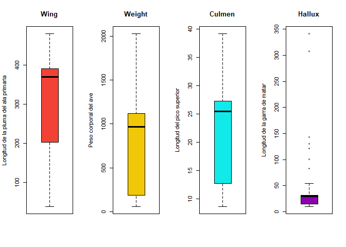<!-- -->

Podemos ver como en Hallux encontramos ouliers, por ello vamos a
realizar el siguiente código.

``` r
outlier_indices <- integer(0)
num <- c("Month", "Day", "Year", "Wing", "Weight", "Culmen", "Hallux", "Tail", 
         "StandardTail", "Tarsus", "WingPitFat", "KeelFat", "Crop")


for (variable in num) {
    Q1 <- quantile(Hawks[[variable]], 0.25, na.rm = TRUE)
    Q3 <- quantile(Hawks[[variable]], 0.75, na.rm = TRUE)
    IQR <- Q3 - Q1
    
    #buscamos outliers según baremo establecido
    these_outliers <- which(Hawks[[variable]] < (Q1 - 1.5 * IQR) | Hawks[[variable]] > (Q3 + 1.5 * IQR))
    outlier_indices <- unique(c(outlier_indices, these_outliers))
}

df_clean <- Hawks[-outlier_indices, ]

df_num_cl <- df_clean[, sapply(df_clean, function(x) 
  is.numeric(x) && !any(is.na(x)))]
```

Para comprobar si se han eliminado los valores atípicos vamos a realizar
el boxplot nuevamente.

``` r
par(mfrow = c(1, 4))
boxplot(df_num_cl$Wing, main = "Wing", ylab = "Longitud de la pluma del ala primaria", col = "#F24236")
boxplot(df_num_cl$Weight, main = "Weight", ylab = "Peso corporal del ave", col = "#F0C808")
boxplot(df_num_cl$Culmen, main = "Culmen", ylab = "Longitud del pico superior", col = "#12EAEA")
boxplot(df_num_cl$Hallux, main = "Hallux", ylab = "Longitud de la garra de matar", col = "#9000B3")
```

<!-- -->

### Escalar los datos

A continuacion vamos a centrar (restar la media) y escalar (dividir por
la desviación estándar) para las variables de interés que hemos estado
estudiando:

- **Wing**: Longitud (en mm) de la pluma de ala primaria desde la punta
  hasta donde se une a la muñeca.
- **Weight**: Peso corporal (en gramos) del ave.
- **Culmen**: Longitud (en mm) del pico superior desde la punta hasta
  donde se encuentra con la parte carnosa del ave.
- **Hallux**: Longitud (en mm) de la garra de matar.

``` r
var_model <- c("Wing", "Weight", "Culmen", "Hallux")

#escalamos las variables que utilizaremos y las seleccionamos para el modelo
Hawks_scaled <- df_clean %>%
  mutate(across(all_of(var_model), ~scale(.))) %>%
  select(all_of(var_model))

head(Hawks_scaled)
```

    ##         Wing     Weight     Culmen     Hallux
    ## 1  0.6756847  0.2713956  0.4913293  0.5399823
    ## 2  0.5795254  0.2932798  0.6474652  0.8040858
    ## 3  0.6329472  0.4245853  0.6317426  0.6887050
    ## 4 -0.6064392 -0.7133958 -0.4915640 -0.2779926
    ## 5 -1.2475012 -1.3699234 -1.3621267 -1.4182000
    ## 6  0.9641626  0.6434279  0.8844866  0.8002471

## Determinación del número de clústeres

Para obtener el número de clústeres vamos a utilizar dos métodos
diferentes para reafirmar cual es el número de clústeres adecuado.

### Elbow method

Este método se basa en la idea de que la suma de los cuadrados de las
distancias intra-cluster, disminuye a medida que aumenta el número de
clusters, pero a partir de cierto punto, los beneficios de agregar más
clusters comienzan a disminuir.

El método del codo consiste en calcular la suma de cuadrados dentro del
cluster para diferentes valores de k (número de clusters) y trazar un
gráfico que represente la suma de cuadrados en función de k.

El objetivo de crear el siguiente gráfico es encontrar el número de
clusters que proporciona la mejor estructura de agrupamiento posible,
evitando tanto la subagrupación como la sobreagrupación.

``` r
# Funcion para calculara la suma de los cuadrados 
wss <- function(k) {
  kmeans(Hawks_scaled, k)$tot.withinss
}

k.values <- 1:10

wss_values <- map_dbl(k.values, wss)

plot(k.values, wss_values,
       type="b",  
       xlab="Numero de clusters K",
       ylab="Suma de cuadrados")
abline(v = 2, col = "red", lwd = 2)
```

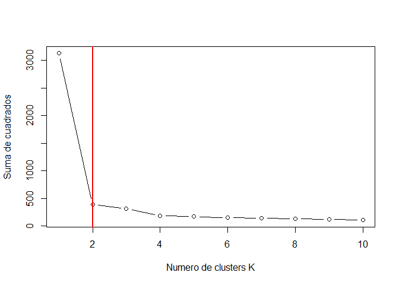<!-- -->

Podemos ver como el *codo* se encuentra en el número 2.

### Average Silhouette

El objetivo del método de Silhouette es evaluar la calidad de un
agrupamiento (clustering) y determinar cómo de bien se encuentran las
observaciones dentro de su respectivo grupo.

Para ello compara la distancia promedio entre una observación y todas
las demás observaciones en su propio grupo (distancia intra-cluster) con
la distancia promedio entre la observación y todas las observaciones en
el grupo más cercano (distancia inter-cluster).

La medida de Silhouette varía entre -1 y 1. Un valor de Silhouette
cercano a 1 indica que una observación está bien asignada a su grupo y
está bien separada de los demás grupos. Por otro lado, un valor cercano
a -1 indica que una observación podría estar asignada incorrectamente a
su grupo y muestra una mayor similitud con otros grupos.

``` r
# Funcion que calcula Silhouette para k clusters
avg_sil <- function(k) {
  km.res <- kmeans(Hawks_scaled, centers = k)
  ss <- silhouette(km.res$cluster, dist(Hawks_scaled))
  mean(ss[, 3])
}

k.values <- 2:10

avg_sil_values <- map_dbl(k.values, avg_sil)

plot(k.values, avg_sil_values,
       type = "b", pch = 19, frame = FALSE, 
       xlab = "Numbero de clusters K",
       ylab = "Silhouette")

abline(v = 2, col = "red", lwd = 2)
```

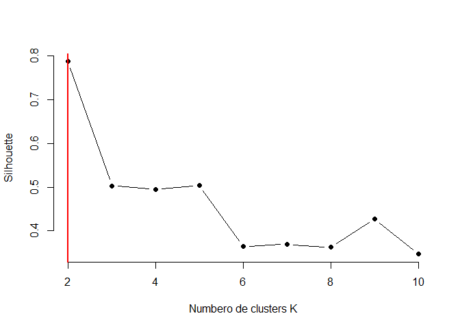<!-- -->

Podemos ver que nuevamente aun que lo esperado es realizar 3 clusters,
lo ideal es realizar 2.

## K-means

Vamos a representar la agrupacion de nuestros datos en 2 clusters:

``` r
k2 <- kmeans(Hawks_scaled, centers = 2)
fviz_cluster(k2, geom = "point", data = Hawks_scaled) + ggtitle("k = 2")
```

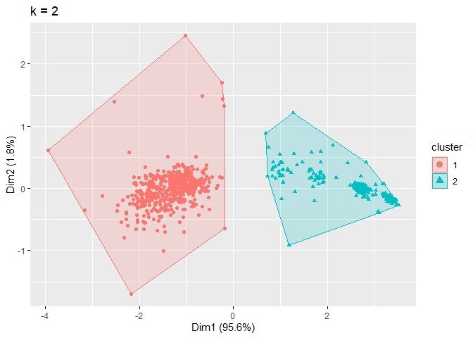<!-- -->

Podemos representar también agrupaciones con mas números de clusters
para compararlas unas con otras

``` r
k3 <- kmeans(Hawks_scaled, 3)
k4 <- kmeans(Hawks_scaled, centers = 4)
k5 <- kmeans(Hawks_scaled, centers = 5)

# plots 
p1 <- fviz_cluster(k2, geom = "point", data = Hawks_scaled) + ggtitle("k = 2")
p2 <- fviz_cluster(k3, geom = "point",  data = Hawks_scaled) + ggtitle("k = 3")
p3 <- fviz_cluster(k4, geom = "point",  data = Hawks_scaled) + ggtitle("k = 4")
p4 <- fviz_cluster(k5, geom = "point",  data = Hawks_scaled) + ggtitle("k = 5")

grid.arrange(p1, p2, p3, p4, nrow = 2)
```

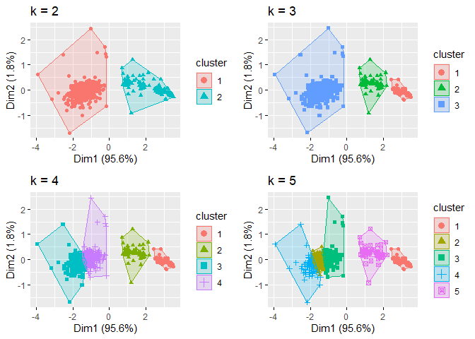<!-- -->

Podemos ver como la agrupación en k=2 esta bastante definida. En el caso
de k=3, también se encuentra suficientemente bien definido como para
utilizar este modelo, dado que, originariamente nos encontramos con 3
especies diferentes. De esta manera, podremos comparar la agrupación por
los 3 clusters que hemos realizado con los datos separados por especies
originales.

``` r
data <- Hawks_scaled
data$kmeans_cluster <- factor(k3$cluster)
data$real_species <- factor(df_clean$Species)


# Gráfico 1: Clasificación k-means (Wing vs Weight)
plot1 <- ggplot(data, aes(x = Wing, y = Weight, color = kmeans_cluster)) +
  geom_point() +
  labs(title = "Clasificación k-means (Wing vs Weight)")

# Gráfico 2: Clasificación real (Wing vs Weight)
plot2 <- ggplot(data, aes(x = Wing, y = Weight, color = real_species)) +
  geom_point() +
  labs(title = "Clasificación real (Wing vs Weight)")

# Gráfico 3: Clasificación k-means (Wing vs Culmen)
plot3 <- ggplot(data, aes(x = Wing, y = Culmen, color = kmeans_cluster)) +
  geom_point() +
  labs(title = "Clasificación k-means (Wing vs Culmen)")

# Gráfico 4: Clasificación real (Wing vs Culmen)
plot4 <- ggplot(data, aes(x = Wing, y = Culmen, color = real_species)) +
  geom_point() +
  labs(title = "Clasificación real (Wing vs Culmen)")

# Gráfico 5: Clasificación k-means (Culmen vs Hallux)
plot5 <- ggplot(data, aes(x = Culmen, y = Hallux, color = kmeans_cluster)) +
  geom_point() +
  labs(title = "Clasificación k-means (Culmen vs Hallux)")

# Gráfico 6: Clasificación real (Culmen vs Hallux)
plot6 <- ggplot(data, aes(x = Culmen, y = Hallux, color = real_species)) +
  geom_point() +
  labs(title = "Clasificación real (Culmen vs Hallux)")

# Organizar los gráficos en una cuadrícula
grid.arrange(plot1, plot2, plot3, plot4, plot5, plot6, ncol = 2)
```

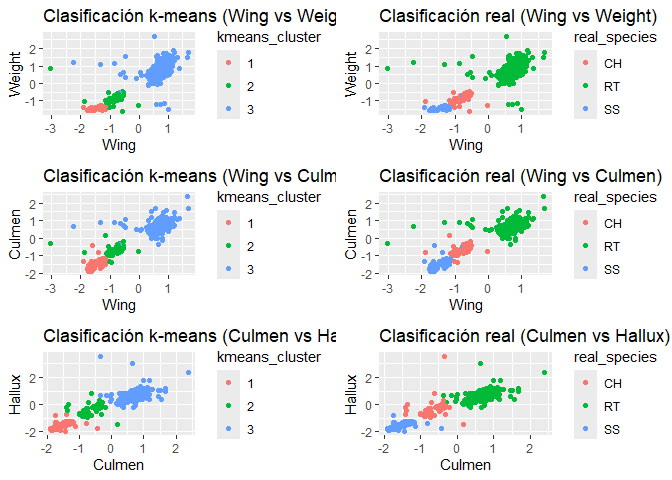<!-- -->

Podemos ver como claramente utilizar 3 clusters ha sido una buena
elección. Podemos ver como el modelo determina adecuadamente cuales son
los valores para cada grupo, coincidiendo con la clasificación original.
De esta manera, poedmos determinar que las variables estudiadas
(casualmente las variables físicas) son ciertamente útiles para
determinar la especie de un individuo.

Podemos ver como los colores no tienen una continuidad entre la
clasificación real y la clasificación hecha por k-means pero la
distribuciones si es la misma. Podemos ver como el cluster 1 son los
Cooper’s (Halcones de Cooper), en el cluster 2 nos encontramos los
Red-tailed (Colirrojos) y en el clister 3 Sharp-Shinned

# Estudio aplicando DBSCAN y OPTICS

Vamos a ordenar los datos utilizando el algoritmo OPTICS (Ordering
Points To Identify the Clustering Structure).

Al configurar minPts=10, estamos especificando que para que un punto sea
considerado central, al menos 10 otros puntos deben estar dentro del
radio especificado (eps). Un valor más alto de minPts resultará en
clústeres más estrictos, ya que requerirá una mayor densidad de puntos
para formar un clúster.

Los puntos que tienen menos de minPts vecinos pero están dentro del
radio eps de algún punto central se consideran “puntos de borde”.
Aquellos que no son centrales ni de borde se consideran “puntos de
ruido”.

## Con outliers

Creamos un diagrama de accesibilidad:

``` r
df_optics <- optics(df_com, minPts = 10, eps = 450)
df_optics
```

    ## OPTICS ordering/clustering for 908 objects.
    ## Parameters: minPts = 10, eps = 450, eps_cl = NA, xi = NA
    ## Available fields: order, reachdist, coredist, predecessor, minPts, eps,
    ##                   eps_cl, xi

``` r
plot(df_optics)

abline(h = 130, col = "red", lty = 5) 
abline(h = 90, col = "blue", lty = 2)
```

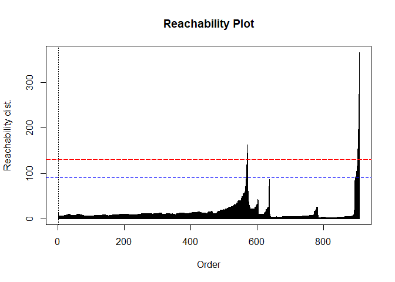<!-- --> En
este diagrama, el eje horizontal (eje x) muestra la secuencia de los
puntos de acuerdo al ordenamiento por OPTICS, mientras que el eje
vertical (eje y) ilustra la distancia de alcanzabilidad.

Los valles en el gráfico simbolizan zonas donde la distancia de
alcanzabilidad es reducida, indicando la presencia de clústeres. La
profundidad de estos valles es una indicación de la densidad de cada
clúster; a mayor profundidad, mayor es la densidad del clúster. Por
contraste, las cimas señalan puntos que se ubican entre diferentes
agrupaciones, los cuales pueden ser considerados outliers o puntos que
no se asocian claramente con ningún clúster.

El corte en diferentes alturas del gráfico nos permite identificar
distintas cantidades de clústeres. Por ejemplo, un corte a la altura de
la línea roja nos revelaría la existencia de dos clústeres, mientras que
un corte a la altura de la línea azul mostraría tres clústeres.

Esta segmentación se puede realizar de la manera siguiente:

``` r
par(mfrow = c(2, 2))

div_2 <- extractDBSCAN(df_optics, eps_cl = 130)
plot(div_2)

div_3 <- extractDBSCAN(df_optics, eps_cl = 80)
plot(div_3)


resultados_cluster_optics <- data.frame(
  Species = Hawks$Species,  
  Cluster = div_3$cluster
)

met_outliers  <- table(resultados_cluster_optics$Species, resultados_cluster_optics$Cluster)
rownames(met_outliers ) <- c("Cooper’s", "Red-tailed", "Sharp-Shinned")

print(met_outliers )
```

    ##                
    ##                   0   1   2   3
    ##   Cooper’s        2   3  60   5
    ##   Red-tailed     14 561   2   0
    ##   Sharp-Shinned   4   1   3 253

``` r
# Comprobación
valores_correctos <- apply(met_outliers, 1, max)
posibles_outliers <- met_outliers[, 1]
errores <- rowSums(met_outliers) - 
  valores_correctos - posibles_outliers

resumen <- matrix(c(valores_correctos, posibles_outliers, errores), nrow = 3, 
                  byrow = TRUE,
                  dimnames = list(c("Valores Correctos", 
                                    "Posibles Outliers (Cluster 0)", "Errores"),
                                  c("Cooper’s", "Red-tailed", "Sharp-Shinned")))
print(resumen)
```

    ##                               Cooper’s Red-tailed Sharp-Shinned
    ## Valores Correctos                   60        561           253
    ## Posibles Outliers (Cluster 0)        2         14             4
    ## Errores                              8          2             4

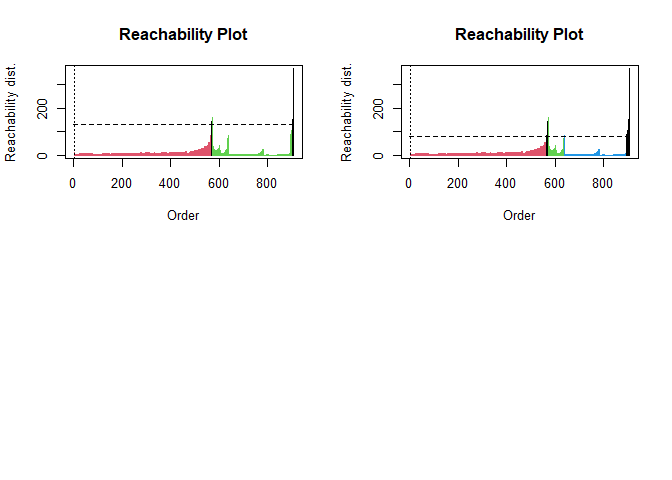<!-- --> Como
podemos observar, a pesar de utilizar todas las variables la
clasificación es bastante buena.

El grupo 0 muestra las observaciones que se han excluido de la
clasificación mientras que los grupos 1, 2 y 3 muestran el numero de
individuos asignados a cada cluster.

Además podemos ver como el modelo no ha realizado muchos erroes. Es
cierto que para el grupo de Copper’s la relación errores/valores es
bastante más notable que los dos otros grupos.

## Sin outliers

Ahora, vamos a realizar el análisis sin tanto ruido, excluyendo los
outliers.

``` r
df_optics2 <- optics(df_num_cl, minPts = 10, eps = 450)
df_optics2
```

    ## OPTICS ordering/clustering for 783 objects.
    ## Parameters: minPts = 10, eps = 450, eps_cl = NA, xi = NA
    ## Available fields: order, reachdist, coredist, predecessor, minPts, eps,
    ##                   eps_cl, xi

``` r
#diagrama de accesibiliadad
plot(df_optics2)
abline(h = 130, col = "red", lty = 5) 
abline(h = 90, col = "blue", lty = 2)
```

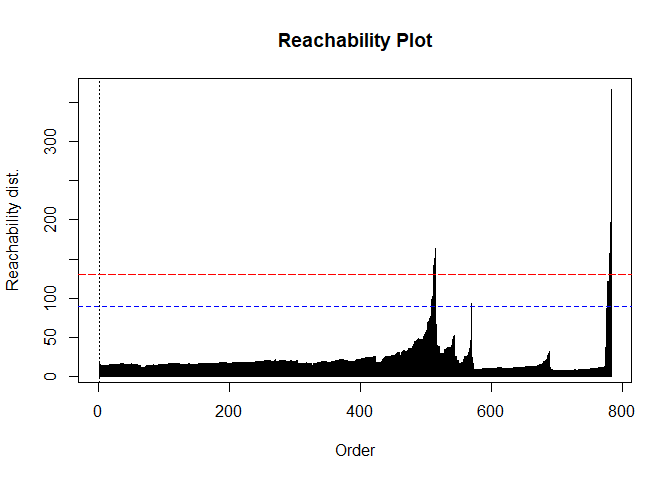<!-- -->

``` r
par(mfrow = c(2, 2))

div_2_2 <- extractDBSCAN(df_optics2, eps_cl = 130)
plot(div_2_2)

div_3_2 <- extractDBSCAN(df_optics2, eps_cl = 80)
plot(div_3_2)
```

<!-- -->

``` r
met_notoutliers <- data.frame(
  Species = df_clean$Species,  
  Cluster = div_3_2$cluster
)

contadores2 <- table(met_notoutliers$Species, met_notoutliers$Cluster)
rownames(contadores2) <- c("Cooper’s", "Red-tailed", "Sharp-Shinned")

print(contadores2)
```

    ##                
    ##                   0   1   2   3
    ##   Cooper’s        2   0  54   4
    ##   Red-tailed     13 507   0   0
    ##   Sharp-Shinned   0   0   1 202

``` r
# valores correctos = máximos, posibles outliers = Clúster 0 y errores = el resto
valores_correctos_2 <- apply(contadores2, 1, max)
posibles_outliers_2 <- contadores2[, 1]
errores_2 <- rowSums(contadores2) - 
  valores_correctos_2 - posibles_outliers_2

resumen_2 <- matrix(c(valores_correctos_2, posibles_outliers_2, errores_2), 
                    nrow = 3, byrow = TRUE,
                  dimnames = list(c("Valores Correctos", 
                                    "Posibles Outliers (Cluster 0)", "Errores"),
                                  c("Cooper’s", "Red-tailed", "Sharp-Shinned")))
print(resumen_2)
```

    ##                               Cooper’s Red-tailed Sharp-Shinned
    ## Valores Correctos                   54        507           202
    ## Posibles Outliers (Cluster 0)        2         13             0
    ## Errores                              4          0             1

Podemos ver como al realizar el modelo sin los outliers obtenemos
valores más con menos errores. Concretamente con 4 Copper’s menos, 2
Red-Tail menos (Clasificando al 100% bien estos pájaros) y 3
Sharp-Shinned menos.

# omparativa de los métodos k-means y DBSCAN

Hemos obtenido resultados destacables para el proyecto de mineria
propuesto. Tanto con means como DBSCAN hemos obtenido una clasificación
satisfactoria, es el momento, de determinar cual de los dos métodos ha
sido más satisfactorio. Para ello realizaremos una tabla parecida a la
utilizada en el anterior apartado.

## Conclusiones de K-means

``` r
met_kmeans <- data.frame(
   Species = df_clean$Species,
   Cluster = k3$cluster
)
 
contadores_kmeans <- table(met_kmeans$Species, 
                           met_kmeans$Cluster)
rownames(contadores_kmeans) <- c("Cooper’s", "Red-tailed", "Sharp-Shinned")
print(contadores_kmeans)
```

    ##                
    ##                   1   2   3
    ##   Cooper’s        1  58   1
    ##   Red-tailed      0   1 519
    ##   Sharp-Shinned 202   1   0

``` r
contadores_kmeans <- table(met_kmeans$Species,
                           met_kmeans$Cluster)
rownames(contadores_kmeans) <- c("Cooper’s", "Red-tailed", "Sharp-Shinned")

#aciertos y errores del kmeans
max_counts <- apply(contadores_kmeans, 1, max)
sum_counts <- rowSums(contadores_kmeans)
error_counts <- sum_counts - max_counts

resumen_kmeans <- data.frame(
  ValoresCorrectos = max_counts,
  Errores = error_counts,
  Species = rownames(contadores_kmeans),
  Tipo = "K-means"
)
df_kmeans <- pivot_longer(resumen_kmeans, cols = c("ValoresCorrectos", "Errores"),
                          names_to = "Medida", values_to = "Valor")


resumen_kmeans
```

    ##               ValoresCorrectos Errores       Species    Tipo
    ## Cooper’s                    58       2      Cooper’s K-means
    ## Red-tailed                 519       1    Red-tailed K-means
    ## Sharp-Shinned              202       1 Sharp-Shinned K-means

Como podemos observar:

- Cooper’s se han clasificado 58 individuos, donde 2 han sido mal
  clasificados, es decr, 3,33%.
- Red-tailed se han clasificado 519 individuos, donde 1 ha sido mal
  clasificado, es decir, 0,19%.
- Sharp-Shinned se han clasificado 202 individuos, donde 1 ha sido mal
  clasificado, es decir, 0,49%.

El algoritmo K-means ha demostrado un alto nivel de precisión en la
clasificación de las aves en estudio. En general, la tasa de
clasificación correcta es bastante elevada. Estos resultados sugieren
que el K-means es eficaz para agrupar las aves en función de sus
atributos físicos, especialmente en el caso de Red-tailed y
Sharp-Shinned.

## Conclusiones de DBSCAN

``` r
print(resumen_2)
```

    ##                               Cooper’s Red-tailed Sharp-Shinned
    ## Valores Correctos                   54        507           202
    ## Posibles Outliers (Cluster 0)        2         13             0
    ## Errores                              4          0             1

Para poder comparar los valores con los obtenidos en el kmeans más
comodamente, vamos a volver a imprimir los valores de DBSCAN sin
outliers (ya que este era el más acertado).

Podemos ver como nos encontramos con más errores que k-means, aún así,
es curioso como este método clasifica Red-tailed mejor que el anterior.
Aún así, debemos destacar que este clasifica 15 valores como Outliers,
cosa que en el anterior modelo no ocurre. Nos encontramos con:

- Cooper’s tiene 5,71% valores de error y 2,85% de outliers.
- Red-tailed tiene 0% de valores de error y 2,5% de outliers.
- Sharp-Shinned tiene 0,49% de valores de error y 0% de outliers.

## Comparación general

En cuanto a la exactitud, K-means tiene un rendimiento levemente
superior a DBSCAN en este conjunto de datos particular. No obstante, la
habilidad de DBSCAN para gestionar datos que no están explícitamente
etiquetados puede resultar beneficiosa en escenarios donde la
configuración de los grupos no está bien definida o cuando se anticipan
categorías anteriormente desconocidas.
